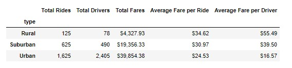
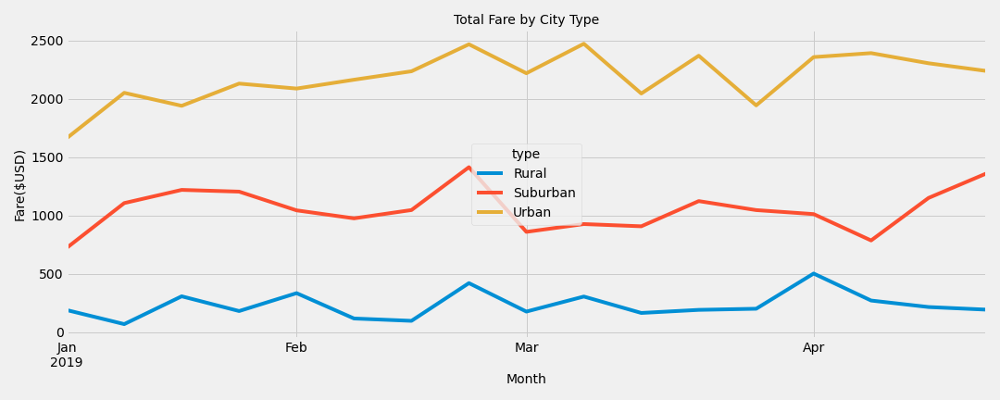

# PyBer_Analysis
Analysis using Python

## Overview of Project
**Analyze all the rideshare data from January to  April of 2019 and create a compelling visualization for top management. The analysis and findings will be used by the top management to make strategic decisions.**

**The Analysis should include the following information:** 

1. Create a summary DataFrame of the ride-sharing data by city type
2. Create a multiple-line graph that shows the total weekly fares for each city type
3. A summary of findings and recommendations

## Resources
- Data Source: [city_data.csv](Resources/city_data.csv); [ride_data.csv](Resources/ride_data.csv)
- Source Code: [PyBer_Challenge](PyBer_Challenge.ipynb)
- Software: Python 3.7.9 64-bit (conda); jupyter-notebook : 6.1.4

## Results
- Code Example:
   
      # 6. Create a PyBer summary DataFrame. 
        pyber_summary_df = pd.DataFrame(
            {"Total Rides":total_rides_count,
             "Total Drivers":total_driver_count,
             "Total Fares":total_fares,
             "Average Fare per Ride":average_fare_perRide,
             "Average Fare per Driver":average_fare_perDriver})

- **Summary DataFrame by City Type**

 - Rural cities bring the lowest revenue which could be caused by the high fare rates per rides (on average the fare rate per ride is higher by ~ $10.1 compared to urban cities)
 - Rural cities have the lowest number of riders and bring the lowest revenue
 - The average fare rate per driver in rural cities is 3.4x higher than in urban cities ($55.49 compared to $16.57)
 - Urban cities have significantly higher number of drivers which translates to better coverage
 

- **Multiple-line chart**

## Summary
- *Business recommendations to address any disparities among the city types:*

   - Rural cities bring the lowest revenue which could be caused by the high fare rates per rides (on average the fare rate per ride is higher by ~ $10.1 compared to urban cities)
   Recommendations:
   1. Increase the number of drivers in rural and suburban cities
   2. Review fare rates in rural and suburban cities
   3. Start tracking the average distance per ride to understand better needs of riders in each city type

  
